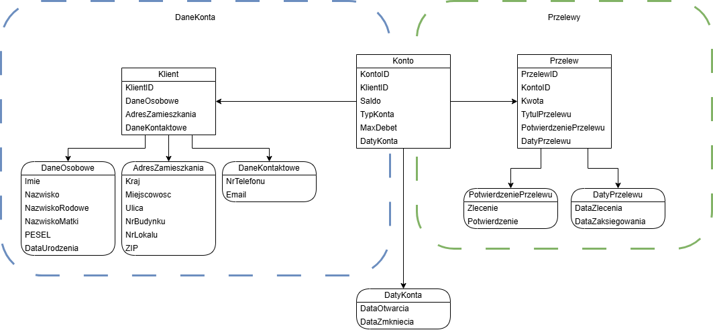

# Model Domain Driven Design danych konta oraz przelewów w systemie bankowym

Powyższy model przedstawia model aplikacji dla systemu bankowego do zarządania danymi konta oraz wykonywania przelewów stworzonej zgodnie z zasadami Domain Driven Design. Aplikacja składa się z dwóch kontekstów: DaneKonta oraz Przelew. DaneKonta zawierają encję Klient z przypisanymi obiektami wartości: DaneOsobowe, AdresZamieszkania oraz DaneKontaktowe. Przelew składa się z encji Przelew z przypisanymi obiektami wartości: PotwierdzeniePrzelewu oraz DatyPrzelewu. Zdefiniowano również agregat Konto łączący encje Klient oraz Przelew.

Obiekt|Atrybut|Format danych|Dodatkowe uwagi
----------------|-------------------------------|-----------------------------|-----------------|
Klient|KlientID|int, UNIQUE
Klient|DaneOsobowe|ValueObject
Klient|AdresZamieszkania|ValueObject
Klient|DaneKontaktowe|ValueObject
DaneOsobowe|Imie|string, wymagane, dopuszczalne: litery
DaneOsobowe|Nazwisko|string, wymagane, dopuszczalne: litery, "-"
DaneOsobowe|NazwiskoRodowe|string, wymagane, dopuszczalne: litery, "-"
DaneOsobowe|NazwiskoMatki|strnig, wymagane, dopuszczalne: litery, "-"
DaneOsobowe|PESEL|int, opcjonalne, dokładnie 11 cyfr
DaneOsobowe|DataUrodzenia|date, wymagane, format RRRR-MM-DD
AdresZamieszkania|Kraj|string, wymagane, zdefiniowana lista do wyboru
AdresZamieszkania|Miejscowosc|string, wymagane, dopuszczalne: litery, "-", \s
AdresZamieszkania|Ulica|strig, opcjonalne, dopuszczalne: litery, cyfry, "-", \s
AdresZamieszkania|NrBudynku|int, wymagane, 
AdresZamieszkania|NrLokalu|int, opcjonalne
AdresZamieszkania|ZIP|int, wymagane, format XX-XXX
Konto|KontoID|int, wymagane, dokładnie 26 cyfr
Konto|KlientID|int, wymagane|identyfikator klienta
Konto|Saldo|int, wymagane| stan konta pomnożony przez 100
Konto|TypKonta|string, zdefiniowana lista do wyboru
Konto|MaxDebet|int|Ustalane przez bank
Konto|DatyKonta|Value Object
DatyKonta|DataOtwarcia|date, format RRRR-MM-DD
DatyKonta|DataZamkniecia|date, format RRR-MM-DD
Przelew|PrzelewID|int, UNIQUE
Przelew|KontoID|int, wymagane, dokładnie 26 cyfr| nr konta docelowego
Przelew|Kwota|int, wymagane
Przelew|TytulPrzelewu|string, dozwolone: litery
Przelew|PotwierdzeniePrzelewu|Value Object
Przelew|DatyPrzelewu|Value Object
PotwierdzeniePrzelewu|Zlecenie|bool
PotwierdzeniePrzelewu|Potwierdzenie|bool
DatyPrzelewu|DataZlecenia|date, format RRRR-MM-DD
DatyPrzelewy|DataZaksiegowania|date, format RRRR-MM-DD